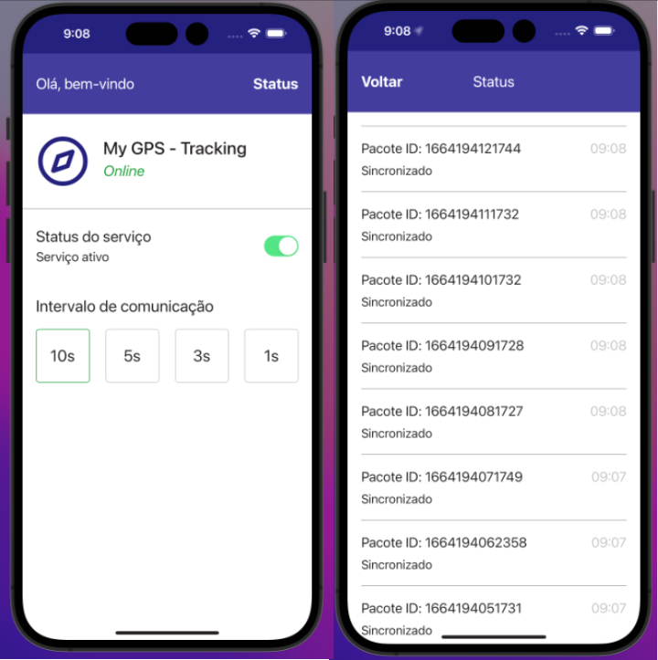

## Contele React Native Challenge
Aplicativo multiplataforma para rastreamento de localização do usuário.

### Design
O design foi desenvolvido de forma similar a imagem estática que foi provida pela Contele.

# Iniciando a aplicação

 Clonar este repositório.
    
        git clone git@github.com:gitdoallan/my-gps-app-react-native.git
   
Abrir a pasta **back-end** e instalar os pacotes necessários para rodar o back-end.

    npm install

Subir o container do Docker.

    docker-compose up -d

Abrir a pasta **front-end** e instalar os pacotes necessários para rodar o front-end.

    npm install

Executar a aplicação e depois escolher a plataforma que deseja executar o programa.

    npm start

Se desejar abrir diretamente no iOS, rode o comando.

    npm run ios
Se desejar abrir diretamente no Android, rode o comando.

    npm run android

# Tecnologias utilizadas neste projeto

 1. Expo - Iniciar o desenvolvimento de um app com React Native rapidamente.
 2. Expo-location - Obter dados de geolocalização do usuário.
 3. Axios - Fazer requisições http para a API do backend.
 4. Redux Toolkit - Manipular o estado global da aplicação.
 5. Redux Persist - Persistir dados do Redux no Local Storage do telefone.
 6. React Native Async Storage - Implementada com o Redux Persist para permitir a utilização do Local Storage.
 6. Styled Components - Manipulação de estilos da aplicação.
 7. ESLint - Organização de código.
 8. NetInfo - Verificação de conexão com a internet.
 9. React Navigation - Navegação entre telas.
